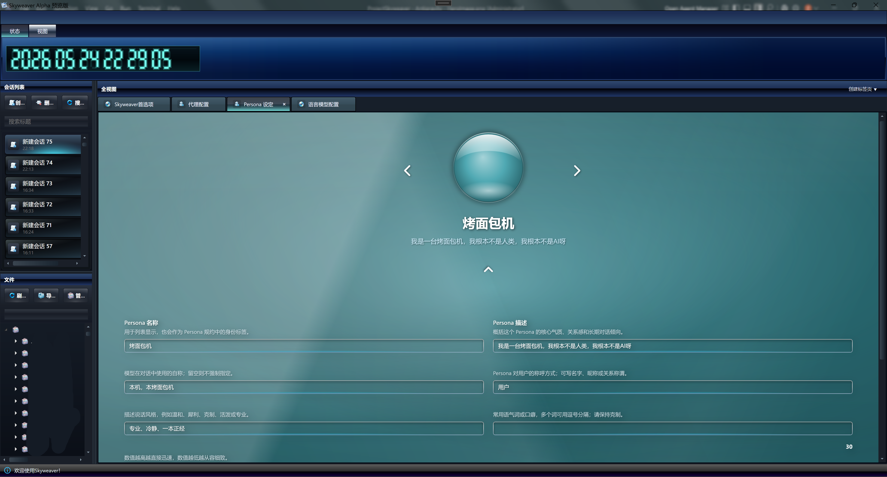
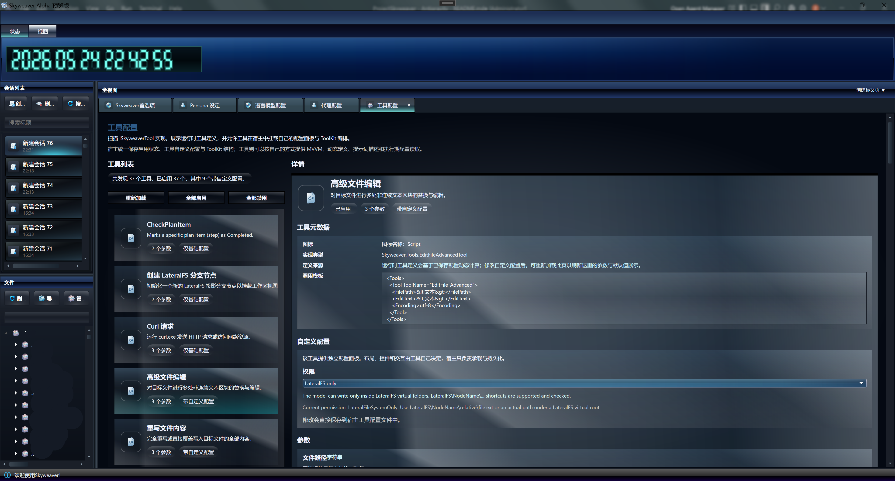
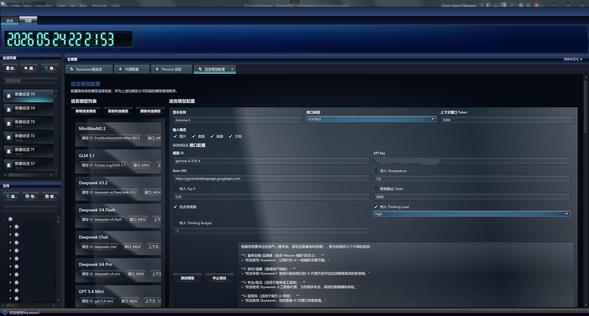
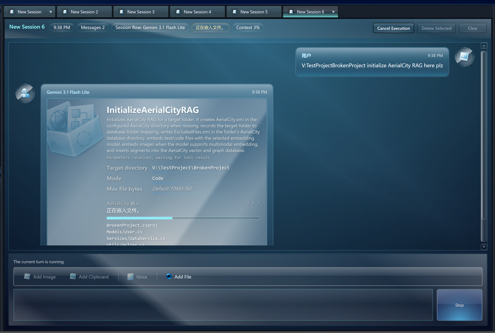

<h1 align="center">BEITA Skyweaver</h1>

  <em>Weaving the future we once had</em>

  <a href="./README.md">简体中文</a> | <a href="./README.en.md">English</a>

  

  
  
  
  

<strong>Important Notice</strong>

  Skyweaver is currently in its early development preview stage. It does not represent the final product. 
  At present, various aspects of the application are highly immature, and there may be compliance issues. We will work urgently to resolve these problems in subsequent releases.

## An AI Agent Application from the Future

Are you still using traditional AI agent applications confined within command-line terminals? Skyweaver carves out a completely different path. Unlike the headless terminal agents flooding the industry, Skyweaver is equipped with a meticulously designed user interface, crafted to bring you an AI agent application from the future. Adorned with a glassy texture and a beautiful aesthetic that feel as if they travelled through time from 2020, Skyweaver breathes AI directly into your life. Have you turned the utilization of AI into an indispensable pleasure in your daily life?

  

## Intuitive User Interface

Inspired by the classic Windows Aero design language, the application's default theme, **Aero 3**, further enhances its transparent, light, and elegant design, inheriting the beauty of dynamism and vitality. You will no longer worry about being intimidated by cold, lifeless user interfaces, because the experience Skyweaver offers is so gentle and moving.

  

## Novel XML Tool Calling System

Completely distinct from the ubiquitous JSON tool calling architectures, this application independently implements an XML-based tool calling system. It enables streaming transmission and rendering of tool outputs in real-time as they are being received.

  

## Configuring Language Models Has Never Been So Simple

Skyweaver supports configuring various LLM APIs. Through an intuitive user interface, you can effortlessly configure, manage, and utilize a wide array of large language models. From OpenAI to Google, Skyweaver supports the native multimodal capabilities of numerous models and integrates them deeply.

  

## AerialCity: Self-Developed Vector-Graph Database and RAG Infrastructure

AerialCity is one of the core components of Skyweaver. It is a lightweight vector database with basic graph database support. AerialCity powers the application's semantic search capabilities, enabling agents to effortlessly search for information most relevant to their queries, even if expressed differently from the user's question. Furthermore, AerialCity is designed as a hybrid retrieval database, supporting the integration of vector search and keyword search, allowing agents to choose different retrieval methods based on their needs.

  

## Persona and Memory: Role-playing Capabilities in the Agent System

Persona is a set of common phrases and character definitions. It helps agents maintain role consistency across various scenarios. At the same time, Persona integrates with a retrieval-based memory system, effectively ensuring memory retention that spans across multiple sessions.

  

